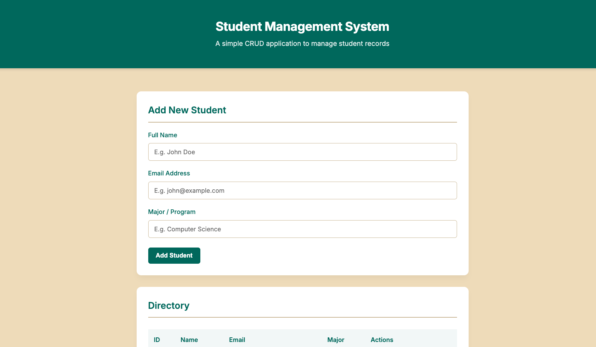
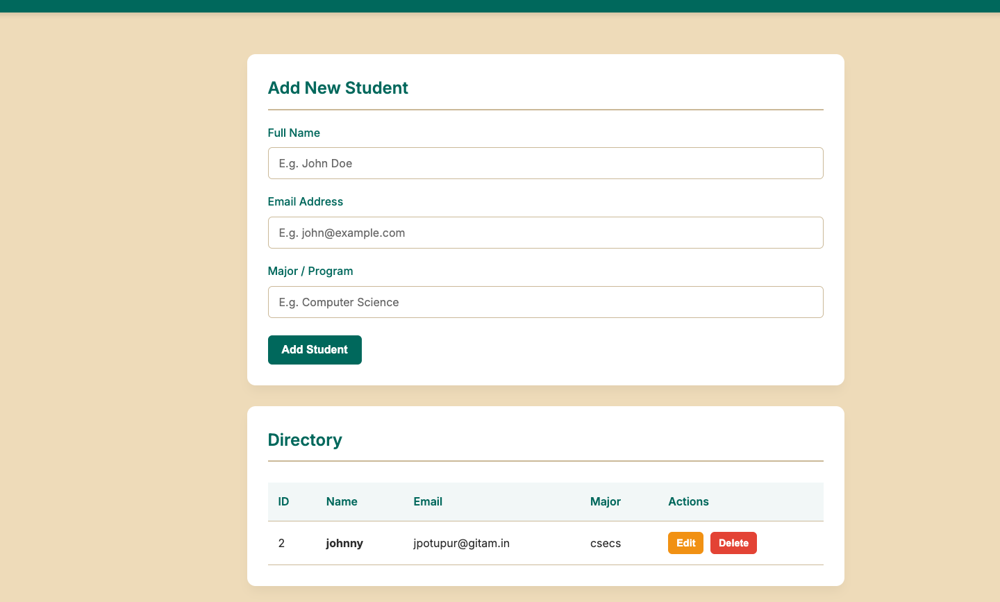
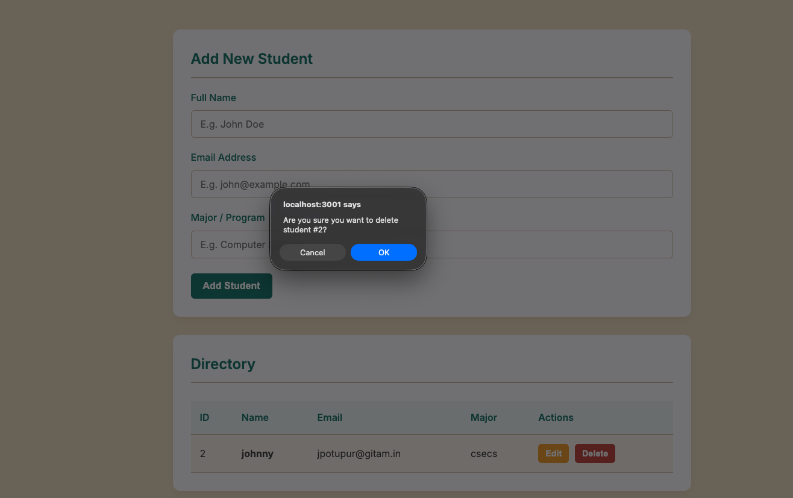

# Project Document

## 1. Title and Objective
**Title:** Student Management System (CRUD Web Application)
**Objective:** To develop a web application using modern Web Technologies (Node.js, Express, HTML/CSS/JavaScript) that seamlessly integrates with a database (SQLite). The objective is to demonstrate the ability to perform basic CRUD operations:
- **C**reate: Add new student records to the database.
- **R**etrieve: Fetch and display a list of all current students.
- **U**pdate: Modify existing student details.
- **D**elete: Remove a student record completely.

## 2. Technologies Used
- **Frontend:** HTML5, CSS3, Vanilla JavaScript
- **Backend:** Node.js, Express.js (REST API framework)
- **Database:** SQLite (Relational Database)
- **Styling:** Custom CSS theme `#007367` (Primary) and `#f0e0c1` (Background).

## 3. Key Source Code

### Database Initialization & CRUD API (`server.js`)
```javascript
// Database Setup
const db = new sqlite3.Database(dbPath, (err) => { ... });
db.run(`CREATE TABLE IF NOT EXISTS students (
    id INTEGER PRIMARY KEY AUTOINCREMENT,
    name TEXT NOT NULL,
    email TEXT UNIQUE NOT NULL,
    major TEXT NOT NULL
)`);

// Insert Data (POST)
app.post('/api/students', (req, res) => {
    const sql = 'INSERT INTO students (name, email, major) VALUES (?, ?, ?)';
    db.run(sql, [name, email, major], function (err) { ... });
});

// Retrieve Data (GET)
app.get('/api/students', (req, res) => {
    const sql = 'SELECT * FROM students';
    db.all(sql, [], (err, rows) => { ... });
});

// Update Data (PUT)
app.put('/api/students/:id', (req, res) => {
    const sql = 'UPDATE students SET name = ?, email = ?, major = ? WHERE id = ?';
    db.run(sql, [name, email, major, id], function (err) { ... });
});

// Delete Data (DELETE)
app.delete('/api/students/:id', (req, res) => {
    const sql = 'DELETE FROM students WHERE id = ?';
    db.run(sql, [id], function (err) { ... });
});
```

### Frontend Fetch Requests (`public/script.js`)
```javascript
// Example: Creating a new student record from the browser
async function createStudent(payload) {
    const response = await fetch('/api/students', {
        method: 'POST',
        headers: { 'Content-Type': 'application/json' },
        body: JSON.stringify(payload)
    });
    // handle response
}
```

## 4. Output Screenshots




## 5. Database Tables
The application uses a single relational table named `students`. Let's look at its structure:

| Column Name | Data Type | Constraints               | Description                             |
|-------------|-----------|---------------------------|-----------------------------------------|
| `id`        | INTEGER   | PRIMARY KEY AUTOINCREMENT | Unique identifier for each student.     |
| `name`      | TEXT      | NOT NULL                  | The full name of the student.           |
| `email`     | TEXT      | UNIQUE, NOT NULL          | The student's email address.            |
| `major`     | TEXT      | NOT NULL                  | The student's enrolled program/major.   |

## 6. Conclusion
This project successfully fulfills the requirement of building a database-connected web application. Using Node.js and SQLite, we seamlessly managed backend routing and database transactions. The frontend client leverages asynchronous JavaScript (`fetch` API) to communicate with these backend endpoints securely. As a result, users can effortlessly manage (Insert, Retrieve, Update, Delete) student records through an intuitive, styled interface without page reloads. This forms the foundational architecture of most modern dynamic web applications.
